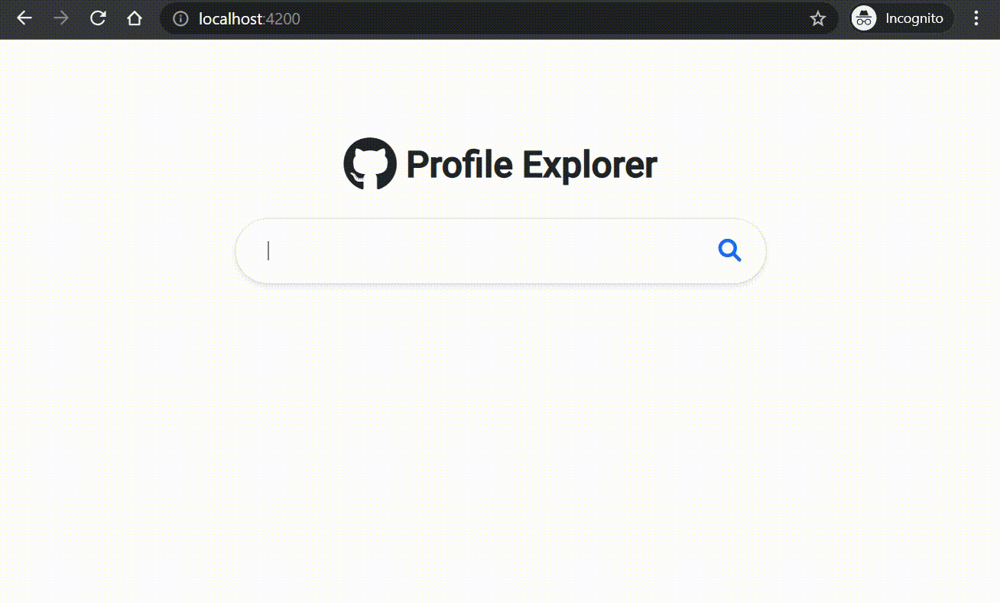
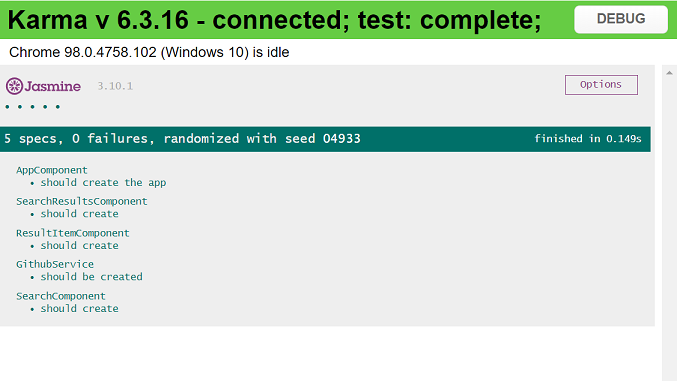
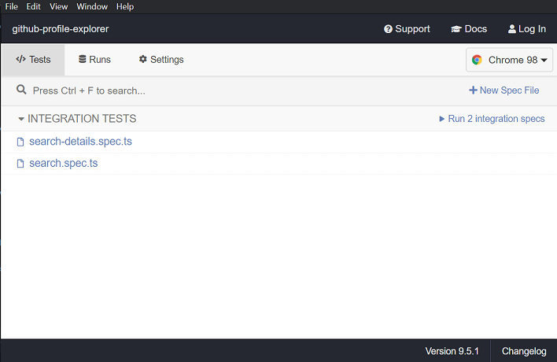
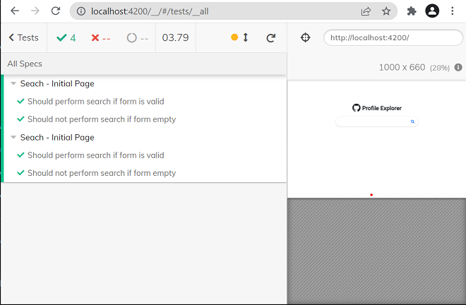

# Github Profile Explorer

Simple application that allows you to search for github users based on their username. 

## Table of contents
* [General info](#general-info)
* [Technologies](#technologies)
* [Installation](#installation)
* [Running Application](#running-application)
* [Unit Tests](#running-unit-tests)
* [End-to-End Tests](#running-end-to-end-tests)

## General info
Simple application that allows to search for github users based on their username. It implements all types of sorts available in the Github API for user searches, and makes it possible to filter these obtained results, through the name of the repository and/or the number of stars that the user has. This also implements pagination.


	
## Technologies
Project is created with:
* [Angular](https://angular.io/) version: 13.0.3
* [Bootstrap](https://getbootstrap.com/) version: 5
* [Jasmine](https://jasmine.github.io/) for unit testing
* [Cypress](https://docs.cypress.io/) for End-to-End testing

## Installation
### Platform & tools

You need to install Node.js and then the development tools. Node.js comes with a package manager called [npm](http://npmjs.org) for installing NodeJS applications and libraries.
* [Install node.js](https://nodejs.org/) 

### Get the Code

Either clone this repository or fork it on GitHub and clone your fork:

```
git clone https://github.com/diegonunesreis/github-profile-explorer.git
cd github-profile-explorer
```

Install local dependencies (from the project root folder):
```
npm install
```
(This will install the dependencies declared in the ./package.json file)


## Running Application

Run `ng serve` for a dev server. Navigate to `http://localhost:4200/`. 

## Running unit tests

Run `ng test` to execute the unit tests via [Karma](https://karma-runner.github.io).



## Running end-to-end tests 

Run `npm run cypress:open` to execute the end-to-end tests via cypress. When this starts, the Cypress splash screen will appear, listing the written tests.



When you start the testing process, a page will open in your default browser, where Crypress will start to interact and test the application.


